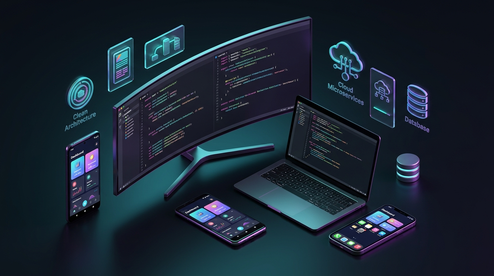

# Hola, mi nombre es David Bernardo 👋

### Freelance Full Stack & Mobile Senior

  

Desarrollador **Full Stack & Mobile Senior con más de 8 años de experiencia** en el diseño, desarrollo e implementación de soluciones de software robustas, desacopladas y de alta disponibilidad.

- 📱 **Android Nativo & Kotlin Multiplatform (KMP):** Desarrollo de alto rendimiento con **Kotlin Multiplatform (KMP), Compose Multiplatform (Desktop & Android), CameraX, Jetpack Compose, Material 3, Clean Architecture, Coroutines, Flow y Room**.
- 🧠 **Backend, Desktop & Streaming:** Especializado en **NestJS, Laravel, AdonisJS y Ktor** aplicando **Domain-Driven Design (DDD)**, **Arquitectura Hexagonal (Puertos y Adaptadores)** y streaming en tiempo real (**OBS WebSocket v5, MJPEG, WebSockets**).
- 🌐 **Frontend Moderno:** Construcción de interfaces reactivas y escalables en **React 19, Vue 3.5, Angular 19 y Compose HTML** con TypeScript y CSS agnóstico.
- ⚡ **Metodologías & Calidad:** Adopción activa de **Spec-Driven Development (SDD)**, arquitecturas modulares y pruebas de carga.
- 🤖 **IA Aplicada:** Integración de **Model Context Protocol (MCP)**, creación de **Skills para Agentes de IA** e ingeniería de prompts para flujos de trabajo avanzados.

---

## ✍️ Publicaciones Técnicas (Dev.to)

| Artículo | Temas Clave |
| :--- | :--- | 
| 🚀 **[Spec-Driven Development (SDD) con IA: Dejando atrás el 'Vibe Coding' para construir software multiplataforma](https://dev.to/davidbernardo/spec-driven-development-sdd-con-ia-dejando-atras-el-vibe-coding-para-construir-software-nd4)** | `SDD`, `Kotlin Multiplatform`, `Compose`, `OBS Studio`, `AI Prompts` |
| 🔌 **[Spec-Driven Development (SDD) en Acción: Conectando una Extensión de Chrome (MV3) con Windows usando Node.js](https://dev.to/davidbernardo/spec-driven-development-sdd-en-accion-conectando-una-extension-de-chrome-mv3-con-windows-4iei)** | `Chrome MV3`, `Native Messaging`, `Node.js`, `Inno Setup` |
| 🏛️ **[Cómo construí mi portafolio en 4 frameworks con Clean Architecture](https://dev.to/davidbernardo/como-construi-mi-portafolio-en-4-frameworks-react-19-vue-35-angular-19-y-compose-html-usando-3i4b)** | `React 19`, `Vue 3.5`, `Angular 19`, `Compose HTML`, `Clean Architecture` |

---

## 🛠️ Stack Tecnológico & Habilidades

### 📱 Android Nativo & Kotlin Multiplatform

-7F52FF?style=for-the-badge&logo=kotlin&logoColor=white)

### ⚙️ Backend, Microservicios & Streaming

### 🌐 Frontend Web

### 🗄️ Bases de Datos & Big Data
-4169E1?style=for-the-badge&logo=postgresql&logoColor=white)

### 🚀 Metodologías, DevOps & Calidad
-6366F1?style=for-the-badge&logo=gitbook&logoColor=white)

### 🤖 IA Aplicada & Agentes
-10B981?style=for-the-badge&logo=openai&logoColor=white)

---

## 📫 Conecta Conmigo

¿Tienes un proyecto desafiante, una oportunidad de liderazgo técnico o quieres conversar sobre arquitectura de software? ¡Escríbeme!

* 🌐 **Portafolio:** [davidbernardo.dev](https://www.davidbernardo.dev)
* 💼 **LinkedIn:** [david-henry-bernardo-cardenas](https://www.linkedin.com/in/david-henry-bernardo-cardenas)
* ✍️ **Dev.to:** [@davidbernardo](https://dev.to/davidbernardo)
* ✉️ **Correo:** [dhenrybernardo@gmail.com](mailto:dhenrybernardo@gmail.com)
